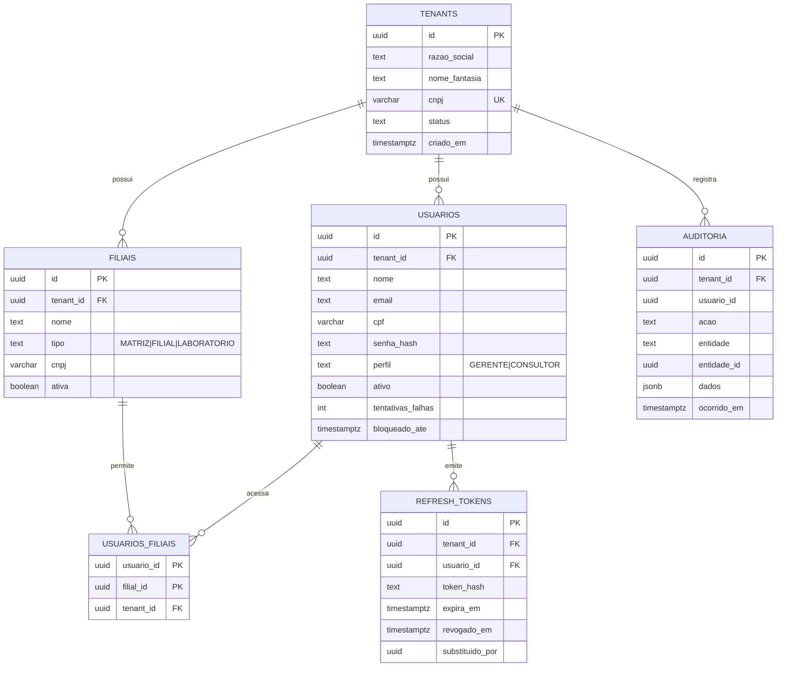

# Convenções de Modelagem Relacional — Fatura Ótica

> Obrigatório para toda migration. Divergências exigem novo ADR.

## 1. Nomenclatura
| Elemento | Padrão | Exemplo |
| :--- | :--- | :--- |
| Schema | módulo, singular, snake_case | `identity`, `os`, `estoque`, `financeiro` |
| Tabela | plural, snake_case, português | `usuarios`, `ordens_servico`, `movimentacoes_estoque` |
| Coluna | snake_case | `nome_fantasia`, `criado_em` |
| PK | `id` | `id uuid` |
| FK | `<entidade_singular>_id` | `filial_id`, `cliente_id` |
| Índice | `ix_<tabela>_<colunas>` | `ix_usuarios_tenant_id_email` |
| Único | `ux_<tabela>_<colunas>` | `ux_usuarios_tenant_id_email` |
| Check | `ck_<tabela>_<regra>` | `ck_receitas_eixo_faixa` |
| FK constraint | `fk_<tabela>_<referenciada>` | `fk_usuarios_filiais` |

## 2. Tipos
| Dado | Tipo PostgreSQL | Observação |
| :--- | :--- | :--- |
| Identificador | `uuid` (UUIDv7 gerado na aplicação) | Ordenável por tempo, sem colisão entre tenants |
| Dinheiro | `numeric(14,2)` | Nunca `money`/`float` |
| Custo unitário / CMP | `numeric(14,4)` | Precisão extra para rateio |
| Dioptria (esf/cil/adição) | `numeric(5,2)` + check múltiplo de 0.25 | `ck_..._passo_025` |
| Eixo | `smallint` + check `0..180` | Nulo se cilindro = 0 |
| Data/hora | `timestamptz` | Sempre UTC |
| Data civil | `date` | Nascimento, validade de receita |
| Enum de domínio | `text` + check | Evita migrations de `ALTER TYPE` |
| Documento (CPF/CNPJ) | `varchar(14)` só dígitos | Validado no domínio |
| Texto livre | `text` | Limites no domínio |

## 3. Colunas padrão
Toda tabela de negócio possui:
```sql
id          uuid        primary key,
tenant_id   uuid        not null references identity.tenants(id),
criado_em   timestamptz not null default now(),
criado_por  uuid        null,
atualizado_em timestamptz null,
atualizado_por uuid     null
```
- **Soft delete** (`excluido_em timestamptz null`) apenas em cadastros (clientes, produtos). Ledgers **nunca** são excluídos.
- Unicidades sempre compostas com `tenant_id` (ex: `ux_usuarios_tenant_id_email`).
- Toda FK indexada; índices compostos começam por `tenant_id`.

## 4. Segurança e integridade
- `ALTER TABLE ... ENABLE ROW LEVEL SECURITY` + `FORCE ROW LEVEL SECURITY` em toda tabela com `tenant_id`.
- Ledgers (`estoque.movimentacoes`, `financeiro.lancamentos_caixa`, `identity.auditoria`): trigger `fn_bloquear_alteracao()` rejeitando `UPDATE`/`DELETE`.
- Invariantes críticos duplicados em `CHECK` no banco (última linha de defesa), além do domínio.

## 5. Modelo inicial — PRD-01 (Identity & Multi-Tenancy)



> `identity.tenants` é a única tabela sem `tenant_id`/RLS. O modelo final do PRD-01 será confirmado no refinamento BDD.
