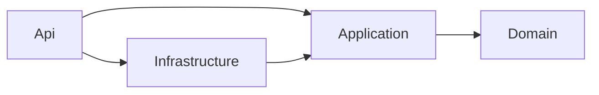

# ADR-0001 — Stack .NET 10 e Clean Architecture

- **Status:** Aceito
- **Data:** 05/10/2026 (Sprint 22)
- **Decisores:** PO, Tech Lead

## Contexto
O Fatura Ótica é um ERP B2B com núcleo financeiro (caixa, DRE, comissões), fiscal (NF-e 4.00) e clínico (dioptrias). Exige precisão decimal, regras de domínio ricas, longevidade e alta testabilidade. O front-end é Next.js/TypeScript.

## Decisão
- **Runtime:** .NET 10 (LTS) / C#, `Nullable` e `TreatWarningsAsErrors` habilitados globalmente.
- **Estilo:** Clean Architecture + DDD tático, monólito modular.
- **Camadas e dependências permitidas:**

| Projeto | Responsabilidade | Pode referenciar |
| :--- | :--- | :--- |
| `FaturaOtica.Domain` | Entidades, Value Objects, eventos de domínio, invariantes. Sem I/O. | nada (apenas BCL) |
| `FaturaOtica.Application` | Casos de uso (commands/queries), validação de entrada, portas (interfaces). | Domain |
| `FaturaOtica.Infrastructure` | EF Core/PostgreSQL, repositórios, hashing, integrações (WhatsApp, S3, SEFAZ). | Application, Domain |
| `FaturaOtica.Api` | Endpoints HTTP, autenticação, middlewares, OpenAPI, composição (DI). | Application, Infrastructure |

- **Organização interna por módulo (vertical slice dentro das camadas):** `Identity`, `OrdensServico`, `Estoque`, `Mensageria`, `Financeiro`, `Configuracoes`, `Shared`.
- As regras de dependência são **verificadas por testes** em `FaturaOtica.Architecture.Tests` (NetArchTest).

## Consequências
- (+) `decimal` nativo, tipagem forte, ecossistema fiscal brasileiro maduro (DFe.NET).
- (+) Domínio testável sem banco; testes rápidos.
- (−) Contratos com o front exigem geração de client TS via OpenAPI (ver ADR-0004).
- (−) Duas stacks no repositório (Node para o front, .NET para o back).
