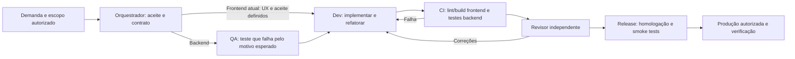

# Workflow de agentes — Fatura Ótica

## Objetivo e alcance

Executar tarefas autorizadas de ponta a ponta, com testes antes do comportamento novo de backend, revisão independente e evidências para a liberação. O orquestrador acompanha uma tarefa até concluí-la ou encontrar uma decisão que dependa do usuário. Aprovações e restrições já fornecidas na conversa continuam válidas.

Este documento define o processo; `AGENTS.md` o torna descobrível pelos agentes e `.github/workflows/quality.yml` executa verificações de qualidade no GitHub. Os arquivos de regras não iniciam agentes ou mantêm um serviço em execução sozinhos. A execução dos agentes depende de um orquestrador com ferramentas de delegação, acesso ao repositório e ao ambiente necessário. O CI de qualidade não publica as aplicações.

## Documentação acompanha cada mudança de estado

A documentação do projeto faz parte da entrega. O responsável atualiza a spec/backlog da sprint, o status geral e o registro especializado (QA, implementação, revisão ou integração) quando a tarefa muda de escopo ou estado: refinamento, contrato, Red, Green, impedimento, revisão, integração ou fechamento. O Scrum Master confere consistência entre esses registros antes de encerrar uma etapa. Não deixar notas somente no chat nem esperar o fechamento da sprint para atualizar o status.

Manter uma fonte de verdade por decisão. Nos registros, separar evidência executada de expectativa e plano: incluir data, branch/SHA quando pertinente, comando, resultado observável e próxima ação; chamar falha de ambiente de impedimento, não de Red. Atualizações de política também alteram o workflow/regra de agente e seu documento de referência na mesma tarefa.

## Fase atual do frontend — decisão do usuário

Enquanto a aplicação está em construção, testes automatizados de frontend (unitários/componentes) e E2E ficam adiados. Não instalar runners, criar essas suítes ou bloquear a sprint pela ausência delas nesta fase.

Para frontend, o fluxo atual é especificação/aceite → UX quando aplicável → implementação → lint e build → revisão independente de código e verificação manual dos fluxos disponíveis. Registrar cenários verificados, resultados e limitações; se uma verificação manual não puder ser feita, registrar o impedimento sem afirmar que foi realizada. IDs semânticos, responsividade e acessibilidade continuam no DoD.

O CI atual do frontend executa instalação, lint e build. A ausência de testes frontend/E2E não é bloqueante; falhas de lint/build e critérios de aceite não atendidos continuam bloqueantes. O script `quality-gate.ps1 -Scope Frontend` permanece preparado para a futura fase com testes e não integra o fluxo atual. Não executá-lo como requisito de conclusão nesta fase.

O backend mantém seus requisitos de testes, TDD e cobertura. A revisão combinada aplica os critérios atuais de cada frente. Entrega frontend aprovada nesta fase significa aprovação pelos critérios acima, sem cobertura automatizada de comportamento. A ativação da fase com testes frontend/E2E depende de nova decisão do usuário e atualização de CI/DoD.

## Fluxo



## Papéis

| Agente | Responsabilidade | Entrega |
| --- | --- | --- |
| Orquestrador | Refinar, registrar o escopo autorizado, delegar, integrar as entregas e acompanhar bloqueios. | Tarefa com critérios de aceite, donos, dependências e estado atual. |
| QA de testes | Traduzir os critérios em testes, registrar a falha esperada e avaliar cobertura de cenários. | Testes e evidência Red; casos de limites, erro, autorização e tenant quando aplicável. |
| Backend | Definir contrato e modelagem; implementar o comportamento mínimo e refatorar. | Código, migrations e contrato OpenAPI; evidência Green. |
| Frontend | Implementar os estados e fluxos aprovados, usando os componentes e o contrato acordados. | UI conforme o escopo, lint/build e evidências de verificação manual dos fluxos disponíveis; testes automatizados adiados. |
| Revisor | Revisar o diff, critérios, testes e implicações da mudança em um contexto independente do autor. | Parecer para a revisão exata de código, com achados e bloqueios. |
| Release | Conferir autorização e evidências, publicar no ambiente autorizado e verificar o resultado. | Versão, SHA, artefato, resultado dos smoke tests e caminho de reversão. |

Papéis podem ser reutilizados em tarefas pequenas. O agente que implementou uma mudança não deve ser o único revisor dela. Uma revisão útil avalia a mudança e seus efeitos; não basta reenviar a resposta do Dev a outro papel.

## Estados e critérios de transição

| Estado | Critério para avançar |
| --- | --- |
| `refining` | Objetivo, limites, critérios testáveis e autorização registrados. |
| `ready` | PRD/escopo autorizado; contrato definido para front/backend; decisões visuais disponíveis quando necessárias. |
| `testing_red` | Apenas backend nesta fase: teste reproduz o comportamento ausente ou o bug; falha de infraestrutura ou compilação não comprova Red funcional. |
| `implementing` | Backend recebeu cenários e testes; frontend avança de `ready` com aceite e definição visual, sem `testing_red`; alterações de intenção voltam ao QA/aceite. |
| `verifying` | Frontend: lint, build e verificação manual dos fluxos disponíveis. Backend: build, testes e cobertura. Evidências correspondem à revisão candidata. |
| `reviewing` | Revisor recebeu o diff, critérios, relatório de qualidade e identificação da revisão. |
| `ready_for_staging` | Qualidade e revisão aprovadas; contrato integrado; estratégia de migration e reversão registrada. |
| `staging` | Ambiente e publicação autorizados; artefato identificado; smoke tests passam após o deploy. |
| `ready_for_production` | Critérios anteriores concluídos; autorização de produção existente e aplicável à versão e ao destino. |
| `released` | Deploy realizado e comportamento verificado; versão, data, responsável e SHA registrados. |
| `blocked` | O impedimento concreto, evidência, responsável pela resolução e condição para retomar estão registrados. |

Essa máquina de estados é um protocolo dos agentes. O CI implementa o gate técnico de qualidade. A automação das transições, da revisão e do deploy exige um orquestrador conectado às ferramentas correspondentes; o arquivo Markdown não impõe essas transições por conta própria.

## Aprovação e autonomia

O orquestrador registra a autorização do usuário que já existe na conversa ou no PRD. Não solicita novamente a mesma aprovação a cada etapa. Um PRD marcado como rascunho não é aprovado pelo agente por conta própria. Mudanças fiscais, financeiras ou de regra de negócio ambíguas precisam de definição do usuário.

Depois de autorizado o escopo, os agentes executam testes, código, refatoração, atualização do grafo, documentação e revisão sem pedir permissão para cada tarefa. Criar um PR pronto para revisão faz parte dessa execução quando as ferramentas e permissões estiverem disponíveis. A integração e a publicação seguem a autorização já registrada para o destino; o agente de Release não deduz autorização de produção a partir de um build verde.

Se a autorização incluir promoção automática para homologação ou produção, registrar isso na tarefa, juntamente com seus critérios. Uma nova versão, ambiente ou operação fora desse escopo exige atualizar a autorização. Não reenviar mensagens para outros chats do usuário sem autorização; usar os agentes internos da tarefa para delegação.

## Isolamento e trabalho em paralelo

Cada tarefa de implementação trabalha em uma branch e checkout/worktree próprios quando houver concorrência. Todos começam pelo mesmo commit base. O revisor inspeciona a revisão candidata em um checkout limpo ou contexto independente.

O contrato permite front e backend em paralelo. Alterações no mesmo arquivo, migration, `package-lock.json`, pacotes centralizados ou contrato têm um único responsável até a integração. Não executar simultaneamente builds, instalações ou geração de código sobre o mesmo diretório de trabalho.

O orquestrador integra as entregas numa candidata e executa os testes novamente se a integração mudar o código. Evidência de uma branch isolada não prova que a combinação funciona. Um checkout de trabalho contém seu próprio grafo ignorado pelo Git; o agente atualiza o grafo desse checkout, sem escrever no de outra tarefa.

## Testes e evidências

### Frontend

Exigir lint e build. Na fase atual, verificar manualmente os fluxos disponíveis e revisar o código; testes automatizados de componentes e E2E ficam adiados por decisão do usuário. Priorizar autorização, navegação, erro/loading/vazio e integração com a API. Verificar responsividade, acessibilidade e IDs semânticos nas telas alteradas.

Na futura fase com testes, o contrato de execução do CI usará `test:unit:ci` e `test:e2e:ci` em `frontend/package.json`. O primeiro deve gerar JUnit em `artifacts/quality/frontend/unit/`; o segundo deve gerar JSON do Playwright em `artifacts/quality/frontend/e2e/results.json`, com um browser Chromium disponível. Scripts ausentes, arquivos ausentes, zero testes, testes que falham ou todos ignorados bloqueiam o gate.

JUnit pode ser produzido por uma ferramenta compatível com testes de componentes. O JSON do Playwright deve ser gerado pelo reporter oficial. Não escrever relatórios falsos para contornar o gate. A configuração das ferramentas e dos testes comportamentais fica para a futura fase autorizada pelo usuário.

### Backend

Build com warnings tratados como erros. Para uma funcionalidade completa, os quatro projetos de testes devem conter testes executados e aprovados: Architecture, Domain, Application e Integration. O gate confirma contagens no TRX; o código de saída zero do `dotnet test` sozinho não basta.

O Domínio precisa de pelo menos 90% de cobertura de linhas, com linhas instrumentadas; resultado vazio não é 100%. O projeto Domain.Tests produz Cobertura por `coverlet.collector`, filtrado para a assembly `FaturaOtica.Domain`. Cenários de endpoint/persistência precisam comprovar autorização e isolamento entre tenants com PostgreSQL real/Testcontainers. O QA mapeia esses cenários aos critérios de aceite; a contagem de testes e a cobertura não provam sozinhas isolamento de tenant.

O modo `Bootstrap` permite validar a infraestrutura atual apenas com testes de arquitetura e identifica explicitamente o resultado como preparação. Esse modo não qualifica a entrega de funcionalidades nem a liberação. O CI de PR usa `Feature` e continua bloqueado enquanto as suítes exigidas estiverem vazias.

### Execução local

```powershell
npm.cmd run lint:frontend
npm.cmd run build:frontend
npm.cmd run build:backend

# Infraestrutura inicial; não autoriza liberação.
pwsh -NoProfile -File scripts/test-backend.ps1 -Level Bootstrap -Configuration Debug

# Gate completo para uma funcionalidade; requer as suítes preenchidas.
pwsh -NoProfile -File scripts/test-backend.ps1 -Level Feature -Configuration Debug

# Somente na futura fase frontend com testes autorizada pelo usuário.
# Não é requisito de conclusão na fase atual.
pwsh -NoProfile -File scripts/quality-gate.ps1 -Scope Frontend -ResultsDirectory artifacts/quality/frontend
```

O runner do backend compila a solução antes de testar, cria um diretório exclusivo e grava `run-source.json` com HEAD, estado do checkout e hash dos arquivos, incluindo arquivos novos. O gate compara a identidade antes/depois, valida os relatórios daquela execução e incorpora falhas de execução no `summary.json`. Na fase atual, o CI do frontend verifica lint e build diretamente, sem exigir relatórios de testes. A identidade de um checkout sujo é um snapshot local, não uma aprovação do SHA para publicação. Não reutilizar saídas antigas para aprovar código novo. Logs e relatórios ficam em `artifacts/`, ignorado pelo Git e pelo grafo; o CI os publica como artefatos da execução correspondente.

## Revisão, integração e liberação

Para PRs e automação de merge, seguir [PR_REVIEW_AND_MERGE.md](PR_REVIEW_AND_MERGE.md). O auto-review/auto-merge de GitHub ainda não está ativado nem suas proteções foram verificadas. Até isso ser comprovado, o revisor independente e o orquestrador seguem o fluxo atual; nenhuma IA contorna os checks.

Usar os modelos de `docs/templates/`. O parecer precisa identificar o SHA candidato e o snapshot/diff quando ainda houver mudanças locais. Qualquer alteração posterior que mude o código invalida a revisão e os testes afetados; a liberação exige checkout limpo, SHA imutável e testes/revisão válidos para esse SHA.

Achados que afetam requisito, autorização, tenant, dados, testes ou funcionamento bloqueiam a entrega. Melhorias sem impacto no aceite podem ser registradas para outra tarefa. O Dev corrige e o revisor confirma os achados resolvidos. Duas tentativas sem progresso no mesmo bloqueio levam a replanejamento; não suprimir regras, remover testes ou reduzir cobertura para encerrar o ciclo.

O Release promove o artefato testado, identifica migrations aplicáveis e confirma compatibilidade entre versões. Smoke tests devem verificar inicialização, conectividade, autenticação/autorização e um fluxo crítico da entrega. Uma migration destrutiva precisa de um plano próprio de recuperação; reverter código não reverte automaticamente dados.

Publicação em staging, configuração de secrets, ambientes e produção dependem do destino definido. O ambiente de produção pode usar proteção do provedor, além da autorização registrada. As possibilidades de aprovação de ambientes no GitHub variam conforme o plano e a visibilidade do repositório; não presumir que essa proteção esteja habilitada. Até essas integrações existirem, o estado máximo verificável localmente é uma candidata revisada, sem afirmar que foi publicada.

## Situação observada em 6 de outubro de 2026 — S1-03B integrada; MVP replanejado

| Verificação | Resultado |
| --- | --- |
| Build frontend | Passou na candidata local develop 7d2c205; sem alteração de código frontend. |
| Lint frontend | Passou na mesma candidata; o diagnóstico inicial de 8 erros/6 warnings é histórico. |
| Testes frontend | Adiados por decisão do usuário; ausência não bloqueia o frontend nesta fase. |
| Build backend | Release passou sem erros ou warnings na candidata limpa 7d2c205. |
| Testes backend | Feature aprovado: Architecture3, Domain21, Application6, Integration61; 91/91, zero skips, Domain100%31linhas. PostgreSQL17 real. |
| Spec de identidade | Sprint01 autorizada; S1-01/02/03A/03B integradas em develop. PRD legado Node/Drizzle não governa esta sprint. SMTP e recuperação self-service adiados para pós-MVP por decisão do usuário em 2026-10-06. |
| CI | Run remoto da integração S1-03B passou em Backend e Frontend, SHA documentado em `docs/sprints/SPRINT-01-STATUS.md`. |
| PR | Criação pelo conector GitHub recusada com403/permissão insuficiente; branch feature publicada e revisão independente versionada. Nenhum PR foi criado. |
| Publicação | Destino do backend, credenciais, smoke tests e política de promoção precisam de definição/configuração. |

## Ordem de implantação

1. Confirmar CI remoto do merge local S1-04A1 em develop; tree de integração foi idêntica ao snapshot revisado.
2. Seguir com S1-04A2 para concessão explícita e S1-04B para ativação segura com link/token repassado manualmente; SMTP não é requisito do MVP.
3. Entregar login/sessões e integrar frontend nas fatias correspondentes. Testes automatizados frontend/E2E permanecem adiados.
4. Configurar verificações obrigatórias no repositório remoto e proteger a integração, conforme os critérios atuais de cada frente. YAML local não altera regras de branch.
5. Conectar o ambiente de homologação, definir smoke tests e configurar a promoção autorizada para produção.

## Referências de implementação

- [setup-node oficial](https://github.com/actions/setup-node)
- [setup-dotnet e global.json](https://github.com/actions/setup-dotnet)
- [Artefatos de execução no GitHub](https://github.com/actions/upload-artifact)
- [Ambientes e proteções de deploy](https://docs.github.com/en/actions/how-tos/deploy/configure-and-manage-deployments/manage-environments)
- [Cobertura de código no .NET](https://learn.microsoft.com/en-us/dotnet/core/testing/unit-testing-code-coverage)
- [Reporter JSON do Playwright](https://playwright.dev/docs/test-reporters#json-reporter)

## Seleção de modelos e contexto

Aplicar [MODEL_ROUTING.md](MODEL_ROUTING.md) em cada delegação. Luna para tarefas simples delimitadas; modelo principal para implementações/revisões críticas. O SM registra seleção, validação e escaladas, envia contexto mínimo suficiente e aplica o modelo na ferramenta. Não alterar critérios de qualidade para economizar consumo.

O modelo, motivo e resultado de validação ficam registrados na tarefa. Para tarefas ordinárias de backend com contrato fechado e baixo risco, usar GPT-6 Luna; para arquitetura, autenticação, permissões, RLS, migrations e mudanças críticas, usar GPT-6.1 Sol. Critérios e escalonamento completos estão em [MODEL_ROUTING.md](MODEL_ROUTING.md).

## Granularidade das execuções

Aplicar [INCREMENTAL_EXECUTION.md](INCREMENTAL_EXECUTION.md). A sprint é o objetivo geral; cada execução resolve um incremento pequeno. O ciclo de qualidade permanece, com evidências do recorte e revisão. Conclusão do incremento, integração em develop e encerramento da sprint são registros distintos. O gate Feature da candidata não foi reduzido.
