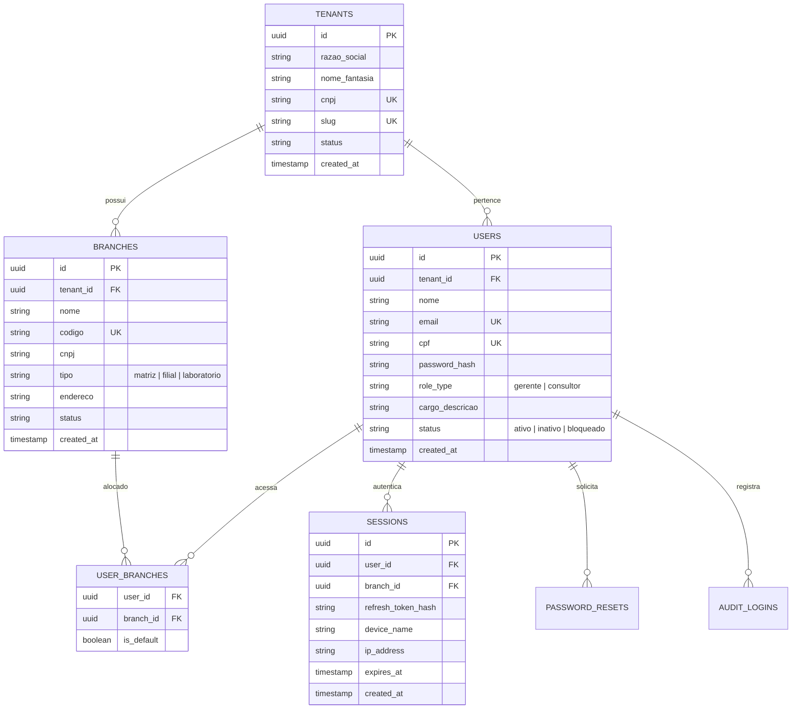

# PRD-01: Identity, Multi-Tenancy & RBAC Engine

> **Status:** 🟡 RASCUNHO TÉCNICO (DRAFT) — PENDENTE DE APROVAÇÃO DO PO  
> **Versão:** 1.0 (Draft)  
> **Autor:** Scrum Master & Tech Lead  
> **Domínio:** Autenticação Corporativa, Gestão de Filiais e Controle de Acesso Baseado em Papel  
> **Stack Recomendada:** TypeScript (Node.js) + PostgreSQL (Supabase / Neon) + Drizzle ORM + Zod

---

## 1. 🎯 Visão e Objetivos

### 1.1 Objetivo de Negócio
Garantir a governança de acesso corporativo e a separação de dados segura para o SaaS B2B **Fatura Ótica**, contemplando:
1. **Multi-Tenancy Rígido:** Isolamento absoluto entre óticas clientes (*Zero Data Leakage*).
2. **Multi-Filiais:** Suporte a matriz, filiais de atendimento e laboratório central sob o mesmo tenant.
3. **RBAC Clean:** Aplicação rigorosa das permissões dos papéis `gerente` e `consultor` diretamente no nível de API e banco de dados (RLS).
4. **Sessão Segura:** Autenticação por e-mail corporativo ou CPF, com tokens de sessão e recuperação criptográfica temporária.

---

## 2. 🗄️ Modelagem de Dados Relacional (PostgreSQL)



---

## 3. 🛡️ Matriz de Permissões RBAC (Enforcement no Back-end)

| Recurso / Rota | Operação | Gerente | Consultor | Regra de Back-end |
| :--- | :--- | :---: | :---: | :--- |
| **Métricas Financeiras** | `GET /api/v1/dashboard/metrics` | ✅ Total | ❌ Bloqueado | Consultor recebe HTTP 403 ou payload sem valores monetários. |
| **Estoque (Preço de Venda)** | `GET /api/v1/inventory` | ✅ Total | ✅ Total | Ambos consultam peças para balcão e conferência. |
| **Estoque (Custo e Margem)** | `GET /api/v1/inventory` | ✅ Total | ❌ Omitido | Campos `custo_unitario` e `margem_lucro` são expurgados do JSON para consultores. |
| **Kardex (Sugestões de Compra)**| `GET /api/v1/kardex/purchase-suggestions` | ✅ Total | ❌ Bloqueado | HTTP 403 para consultores. |
| **Kardex (Ajuste Manual)** | `POST /api/v1/kardex/adjustments` | ✅ Total | ❌ Bloqueado | Exige autorização explícita de gerente. |
| **Ordens de Serviço** | `POST /api/v1/orders` | ✅ Total | ✅ Total | Ambos criam e consultam ordens. |
| **Descontos na OS** | `POST /api/v1/orders/apply-discount` | ✅ Total | ⚠️ Limitado | Descontos acima de 10% exigem senha de gerente. |
| **Troca de Filial** | `POST /api/v1/auth/switch-branch` | ✅ Total | ⚠️ Validado | Usuário só pode alternar para filiais associadas a ele. |

---

## 4. 🔌 Contratos de API (Endpoints REST)

### 4.1 Autenticação (`POST /api/v1/auth/login`)
- **Body:**
```json
{
  "identifier": "carlos.ramos@faturaotica.com.br",
  "password": "senha_segura_aqui",
  "branch_id": "9b1deb4d-3b7d-4bad-9bdd-2b0d7b3dcb6d",
  "remember_device": true,
  "device_name": "Terminal Balcão 01 - LAB-09"
}
```
- **Response (200 OK):**
```json
{
  "access_token": "eyJhbGciOi...",
  "token_type": "Bearer",
  "expires_in": 3600,
  "user": {
    "id": "a3b84179-8db2-48f8-b391-766a5fa2b0b1",
    "name": "Dr. Carlos Ramos",
    "role": "Gerente Operacional & Optometrista",
    "role_type": "gerente",
    "tenant_id": "c1f1074e-76e3-4796-9fcf-b6732cf07d89"
  },
  "branch": {
    "id": "9b1deb4d-3b7d-4bad-9bdd-2b0d7b3dcb6d",
    "name": "Filial Centro - Loja 01 (Matriz)",
    "cnpj": "14.238.991/0001-44"
  }
}
```

### 4.2 Perfil Ativo (`GET /api/v1/auth/me`)
- Retorna dados do operador autenticado e filiais vinculadas para alternância rápida.

### 4.3 Alternar Filial (`POST /api/v1/auth/switch-branch`)
- Emite novo access token para a nova filial selecionada.

### 4.4 Recuperação de Senha (`POST /api/v1/auth/forgot-password`)
- Gera token criptografado temporário (TTL de 15 minutos).

---

## 5. 🔒 Segurança & Políticas no Banco (PostgreSQL RLS)

```sql
-- Ativação do RLS na tabela de Ordens de Serviço e Estoque
ALTER TABLE ordens_servico ENABLE ROW LEVEL SECURITY;
ALTER TABLE produtos_estoque ENABLE ROW LEVEL SECURITY;

-- Política de isolamento por Tenant
CREATE POLICY tenant_isolation_policy ON ordens_servico
    AS RESTRICTIVE
    USING (tenant_id = NULLIF(current_setting('app.current_tenant_id', true), '')::uuid);
```

---

## 6. 📋 Critérios de Aceite para o DoD (Definition of Done)

- [ ] Migrações do banco criadas e aplicadas via Drizzle/Prisma.
- [ ] Hash de senha implementado com Argon2id ou Bcrypt com salt 12.
- [ ] Seed com contas pré-configuradas de homologação (`carlos.ramos` e `mariana.souza`).
- [ ] Rate limiting ativo de no máximo 5 tentativas de login por minuto por IP.
- [ ] Testes de isolamento multi-tenant cobrindo 100% dos cenários de tentativa de vazamento.
